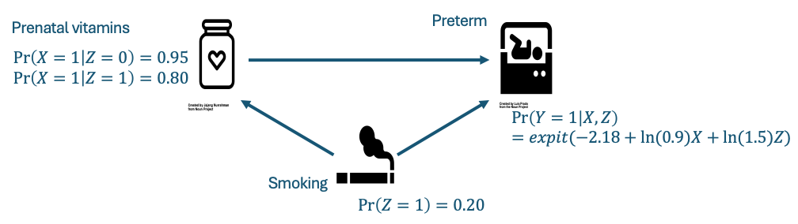

::: {.callout-note appearance="minimal"}
**Prefer to work locally?** [Download the local version](downloads/activity-1.qmd){download="activity-1.qmd"} — a standard `.qmd` file with regular R chunks you can run in RStudio or with `quarto render`. The local version uses a sample of 10,000,000 to estimate bias — the browser version is scaled down to 2,000,000 so it runs quickly here.
:::

**In this activity, we illustrate the key steps first for one single random sample from the data generating mechanism (DGM). Activity 2 will adapt this for 1,000 random samples.**

## Before you begin

The packages below are pre-installed for this page. Run this chunk to load them into your session.

```{webr}
library(dplyr)
library(purrr)
```

## Step 1. Outline the specific aims.

**Context:** We want to estimate the effect of prenatal vitamin supplementation on the risk of preterm birth. However, we are worried about confounding by maternal smoking, which is not measured in our data.

**Simulation Objective:** Quantify the magnitude and direction of bias in our estimate of the effect of prenatal vitamins on the risk of preterm birth under scenarios where maternal smoking decreases the use of prenatal vitamins but increases the risk of preterm birth.

## Step 2. The DGM.

We need to develop code that can generate one randomly sampled cohort based on our predefined data generating mechanism. We start with one cohort to build out this code.

### Helper functions

First, create "helper" functions we will use throughout our simulation.

```{webr}
# The expit function is the inverse of the log-odds. It takes in a log-odds (x), applies
# the inverse-logit function and returns a probability
expit <- function(x) {
  return(exp(x) / (1 + exp(x)))
}
```

### Pseudo random number generation

**1. Why do we want random numbers?**

Simulations use random numbers to stand in for uncertainty / variability. We can use this to:

- model real-world random error
- approximate things that are hard to solve analytically
  - can't use exact math? simulate!
  - we do this when want to know the "truth"
- test statistical methods
  - see how well a test or estimator performs (bias, standard error, coverage)
- bootstrap!
  - uses random resampling to estimate uncertainty

**2. How does R generate random numbers?**

Computers can't generate truly random numbers. R uses a "pseudo-random number generator" — an algorithm that produces a seemingly random sequence of numbers but is fully determined by a starting value (the "seed"). The generator will not repeat for a long time, and for our purposes is random enough.

**3. What are we doing when we set the seed?**

When we set the seed, we are telling R where to start in the pseudo-random number sequence. This allows us to replicate our results in other R sessions. If we don't set the seed, the pseudo-RNG uses the system clock and process ID, so results will differ every session.

**4. Why do we care about setting the seed?**

For reproducibility!

```{webr}
# RNG without setting the seed
rnorm(5)

# Do it again -- different numbers!
rnorm(5)

# Now set the seed
set.seed(24601)
rnorm(5)

# Set it again and rerun
set.seed(24601)
rnorm(5)
# The same numbers, hopefully!
```

Now let's set the seed for the rest of the simulation. Do this **before any random number generation**.

```{webr}
set.seed(293857)
```

### Assign our simulation parameters

Next, we set our simulation parameters based on the prenatal example. Setting them up as variables lets us change them easily and sets us up for success for creating a function later on.

Recall our DAG:

{fig-align="center" width="60%"}

```{webr}
n <- 2000000 # large sample size, so we can estimate bias directly (see Step 5)
prob_smoke <- 0.2 # probability of Z = 1 (smoking)

# probabilities for observed treatment
# 95% non-smokers use prenatal vitamins
# 80% smokers use prenatal vitamins
prob_prenatal <- c(0.95, 0.80)

# effects (log odds ratios) of smoking and prenatal vitamins on the outcome
or_prenatal <- log(0.9) # odds ratio for prenatal vitamins on preterm birth
or_smoke <- log(1.5)    # odds ratio for smoking on preterm birth

# outcome model intercept (derived using the balancing intercept, see below)
y_intercept <- -2.18
```

### Create the simulated dataset using simulation parameters

We do this using potential outcomes. The steps are as follows:

1. Generate the baseline population, where 20% of the population are smokers.

$$Z\sim Bernoulli(p=0.2)$$

2. Next, generate the potential outcomes. For each individual, we generate the potential outcome for preterm birth under each "treatment strategy" (prenatal vitamins vs. no prenatal vitamins) conditional on smoking status. This allows us to recover the truth, because it breaks the confounding structure.

$$Y^{x=0}\sim~Bernoulli(p=expit(-2.18 +log(1.5)\times Z))$$

$$Y^{x=1}\sim~Bernoulli(p=expit(-2.18 +log(1.5)\times Z + log(0.9)\times X))$$

3. Generate observed treatment conditional on smoking status.

$$X|Z=1\sim Bernoulli(p=0.80)$$

$$X|Z=0\sim Bernoulli(p=0.95)$$

4. Assign the observed outcome based on the observed treatment.

$$Y = Y^{x=1}\times X + Y^{x=0}\times (1-X)$$

```{webr}
# Now, create the dataset
data1 <- dplyr::tibble(
  # Create n participants
  id = 1:n,

  # Randomly select smoking
  smoke = rbinom(n = n, size = 1, prob = prob_smoke),

  # Generate potential outcome under no treatment
  preterm_x0 = rbinom(n = n, size = 1,
                      prob = expit(y_intercept + (or_smoke * smoke))),

  # Generate potential outcome under treatment
  preterm_x1 = rbinom(n = n, size = 1,
                      prob = expit(y_intercept + (or_smoke * smoke) + or_prenatal)),

  # Generate observed treatment conditional on smoking
  p_prenatal = prob_prenatal[smoke + 1], # probability of prenatal based on smoking
  prenatal = rbinom(n = n, size = 1, prob = p_prenatal),

  # Assign actual outcome conditional on observed treatment
  preterm = preterm_x0*(1-prenatal) + preterm_x1*(prenatal)
)
```

### Aside: deriving the balancing intercept

Using R! Very helpful if we want to start moving parameters around and need to rederive the intercept.

```{webr}
derive_intercept <- function(py, prob_prenatal, prob_smoke,
                             or_smoke, or_prenatal){

  # marginal probability of treatment
  prob_prenatal <- prob_prenatal[1] * (1-prob_smoke) + prob_prenatal[2] * prob_smoke

  -log(1/py - 1) - or_prenatal*prob_prenatal - or_smoke*prob_smoke
}

beta0 <- derive_intercept(
  py = 0.1, # desired risk of preterm birth
  prob_prenatal = prob_prenatal, # probability of X = 1 (prenatal vitamins) given smoking
  prob_smoke = prob_smoke, # proportion Z = 1 (smoking in the population)
  or_smoke = or_smoke,     # smoking confers 1.5x odds of preterm
  or_prenatal = or_prenatal # prenatal vitamins confers 0.9x odds of preterm
)

round(beta0, 2)
```

### Test the simulated dataset

Evaluate whether the marginal proportions of specific variables match your expectations.

Look at the marginal distribution of smoking. We would expect ~20% to have smoke equal to 1.

```{webr}
# Smoking
prop.table(table(data1$smoke)) # Approximately 20% smoke = 1
```

Look at the marginal distribution of prenatal vitamin supplementation. We would expect ~80% of smokers and ~95% of non-smokers to have prenatal equal to 1.

```{webr}
# Prenatal
smk1 <- subset(data1, smoke == 1)
smk0 <- subset(data1, smoke == 0)
prop.table(table(smk1$prenatal)) # Approximately 80%
prop.table(table(smk0$prenatal)) # Approximately 95%
```

Look at the marginal probability of preterm birth. We would expect ~10% of the total population to have experienced a preterm birth.

```{webr}
# Preterm birth
prop.table(table(data1$preterm)) # Approximately 10%
```

## Step 3. Define the estimand or target of the analysis.

Here, we are interested in the total effect of prenatal vitamins on the risk of preterm birth. We want to quantify this as the marginal risk difference among the entire baseline population. Essentially, we want to contrast the risk had everyone received prenatal vitamins and the risk had no one received prenatal vitamins.

$$E(Y^{x=1})-E(Y^{x=0})$$

## Step 4. Identify the methods to be implemented in the study.

We are not comparing methods but instead want to understand the effect of confounding on our results. As a result, we need only identify a method that targets the **total** effect of prenatal vitamin use on the risk of preterm birth. Direct outcome model adjustment would provide a conditional RD, while we want the marginal estimate that targets the baseline population.

One appropriate method for doing this is inverse probability of treatment weighting. Below, we calculate the unadjusted and adjusted RD.

### Calculate the unadjusted risk difference.

```{webr}
unadjusted <- glm(preterm ~ prenatal, data = data1, family = binomial(link="identity"))

cat("Unweighted risk difference:", round(unadjusted$coefficients[2], 3))
```

### Calculate the risk difference after adjusting for confounding by smoking.

First we estimate the weighted risk difference with the known weights.

#### With known weights for prenatal vitamins by smoking status

```{webr}
data1$ipw <- with(
  data1,
  dplyr::if_else(prenatal == 1,
                 1/p_prenatal,       # If received prenatal vitamins, this is 1/p_prenatal
                 1/(1-p_prenatal))   # If did not receive prenatal vitamins, this is 1/(1-p_prenatal)
  )

# generalized linear model with a binomial family and identity link to get the risk difference
adj_known <- glm(preterm ~ prenatal, data = data1,
                 weights = ipw, family = binomial(link = "identity"))

cat("IPW risk difference (known weights):", round(adj_known$coefficients[2], 3))
```

Here, we can see that the weighted risk difference is different from the unweighted estimate.

## Step 5. Specify the performance measures.

We have determined that we are interested in bias as a performance measure.

For each sample, bias is equivalent to $\hat{\theta}-\theta$, where $\theta$ is the true risk difference.

For multiple samples, $Bias = E[\hat{\theta}] - \theta$. If we are *only* interested in bias, we don't necessarily need to generate a bunch of repeated samples — we can just take one large sample and compare the unweighted and weighted estimates to the truth. Note this is not true for all scenarios: here our estimators converge to a true value as $n$ grows large, are linear (risk difference), and we are not exploring issues with finite sample bias.

Using our large sample and potential outcomes we already generated, we can determine the "truth" to use for estimating bias. We could also do this mathematically, since this is a simple example — see the appendix of the slides.

```{webr}
true_rd <- mean(data1$preterm_x1) - mean(data1$preterm_x0)

cat("Bias unweighted:", round(unadjusted$coefficients[2] - true_rd, 4))

cat("Bias IPW RD (known weights):", round(adj_known$coefficients[2] - true_rd, 4))
```

If we have any interest in the sampling distribution of our estimators (MSE, variance, CI coverage), we need to move to repeated sampling. That's what **Activity 2** does next.
