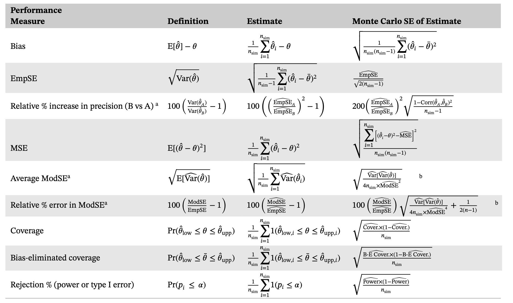

# Why Simulate?

Analytic derivations can tell us the large-sample properties of an estimator, but they rarely tell us how that estimator behaves at a realistic sample size, under model misspecification, or when we have to deal with multiple nuisance models (e.g., propensity score, missing data, measurement error correction). Monte Carlo simulation fills that gap: we specify a data-generating mechanism (DGM) for which we know the truth, generate many random samples from it, apply the method(s) we want to evaluate, and compare the results back to the known truth.

Simulation is useful whenever you need to:

- Model real-world random error and sampling variability
- Approximate a quantity that is hard or impossible to solve for analytically
- Test how well an estimator performs (bias, variance, confidence interval coverage) under known conditions
- Understand what happens when an assumption is violated (e.g., unmeasured confounding)

# The ADEMP Framework

Throughout this workshop we plan every simulation study using the **ADEMP** framework [Morris, White, and Crowther, *Statistics in Medicine*, 2019](https://pmc.ncbi.nlm.nih.gov/articles/PMC6492164/), which organizes the design of a simulation study into five components:

| Letter | Component | Question it answers |
|---|---|---|
| **A** | Aims | What are we trying to find out? |
| **D** | Data-generating mechanisms | How will we simulate data that reflects the scenario of interest? |
| **E** | Estimand | What quantity, exactly, are we trying to estimate? |
| **M** | Methods | Which estimator(s) will we apply to the simulated data? |
| **P** | Performance measures | How will we judge whether a method worked well? |

# The Running Example

**Clinical question:** Does taking prenatal vitamins during pregnancy reduce the risk of preterm birth?

**The complication:** We're worried about confounding by maternal smoking. Smoking is associated with *lower* use of prenatal vitamins and a *higher* risk of preterm birth.

```{r}
#| echo: false
#| out-width: "70%"
#| fig-align: center
knitr::include_graphics("figures/dgm_dag.png")
```

Mapped onto ADEMP, the running example looks like this:

- **Aims** — 

1. Quantify the bias in the estimated effect of prenatal vitamins on preterm birth when maternal smoking confounds the relationship but is unaccounted for in the analysis.

2. Compare approaches (naive, robust) to standard error estimation.

3. (Bonus): Planning sample size or understanding precision at a fixed sample size. 


- **Data-generating mechanism** — Simulate smoking status, both potential outcomes for preterm birth (with and without vitamins), observed vitamin use conditional on smoking, and the observed outcome — see Activity 1.
- **Estimand** — The marginal risk difference, $E[Y^{x=1}] - E[Y^{x=0}]$: the risk of preterm birth had *everyone* taken prenatal vitamins vs. had *no one* taken them.
- **Methods** — An unadjusted risk difference, and inverse probability of treatment weighted (IPTW) risk differences using the known treatment weights — see Activities 1–2.
- **Performance measures** — Bias (Activity 1), and average model-based vs. sandwich standard errors (Activity 2).

## Table 6. Performance measures: definitions, estimates, and Monte Carlo standard errors from Morris et al. (2017)
```{r}
#| echo: false
#| out-width: "100%"
#| fig-align: center

```
